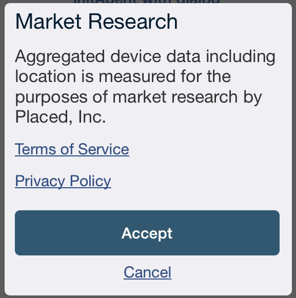

## Introduction

The Placed iOS SDK is designed to help you add Placed location gathering to your app. It exposes simple public API calls that can be used to turn location gathering on and off.

Additionally it exposes a mechanism you can use to retrieve the locations gathered by the agent and synchronize your server activity.

The SDK has been designed for easy set up and integration with both new and existing mobile applications.

## Integration Checklist

Here is a checklist for your integration process. For each step you can find more information below.

1. Add code to project.  *See Installation*
2. Check project permissions.  *See Project Configuration*
3. Add agent create code to `applicationDidFinishLaunching:withOptions:`.
4. Add call to `[PlacedAgent startTracking]`.
5. Show the opt in dialog or call `[PlacedAgent setOptInStatus:Accepted]`.
6. Setup additional calls for extra features (demographics, unique ids).

## Installation

There are two ways to install the Placed SDK. The preferred method is using [CocoaPods](http://cocoapods.org/), a dependency management system for Objective-C development.

### Installation with CocoaPods

1. Add the following line to your project's Podfile:

    ```
    pod 'Placed', :git => 'https://github.com/placed/ios-placed-sdk.git'
    ```
2. Run the following command:

   ```
   $ pod install
   ```
3. Celebrate!

### Manual Installation

The Placed SDK is distributed as 2 files
1. Placed.framework - The Placed library code with included headers
2. Placed.bundle - The resources bundle containing images, xibs, and other required resources

After adding the Placed SDK .framework and .bundle files to your project, select your app's target and click on the Build Phases tab. Make sure the settings in there match the following.

* Link Binary With Libraries:
    * CoreData.framework
    * CoreTelephony.framework
    * CoreLocation.framework
    * CoreMotion.framework
    * SystemConfiguration.framework
    * AdSupport.framework
    * libz.dylib
    * sqlite3.dylib
    * UIKit.framework
    * Foundation.framework
    * CoreGraphics.framework
    * Security.framework
    * Placed.framework
* Copy Bundle Resources:
    * Placed.bundle

The Placed SDK makes use of Objective-C categories. To get those to load correctly you may need to add the following Linker Flags.

* Under Build Settings -> Other Linker Flags
    * –all_load
    * -ObjC

The Placed SDK depends on several Open Source projects including:

* [Reachability](https://github.com/tonymillion/Reachability)
* [Base64](https://github.com/ekscrypto/Base64)

If you are not using CocoaPods please use the versions of these frameworks that were distributed along with your copy of Placed.framework. These can be included in your project like any other code file.

Try building your project. If Xcode can’t find the PlacedAgent.h header file try modifying the "Header Search Paths" under the Build Settings of your main target to include where you added Placed.framework.

## Project Configuration

This SDK requires background location permissions. Under the "Required background modes" key in your app’s main plist file you should make sure to add:

```
App registers for location updates
```

Additionally, the Placed SDK requires that location information be collected "Always," not just when your app is in the foreground.  To ensure that your users cannot select "When in Use" when granting your application location permissions, be sure to delete the "NSLocationWhenInUseUsageDescription" key from your app's main plist file if it is present.

**This permission is very important to the Placed SDK. If your app does not currently use it contact a Placed Representative **

## Integration

**Initialize**

+ Add `#import <Placed/PlacedAgent.h>` to your main AppDelegate.

+ Initialize the agent in your AppDelegate's `application:didFinishLaunchingWithOptions:`

+ If you plan to use the `PlacedAgentDelegate` protocol create an instance of your delegate to supply to the agent create function. (*See Agent Delegate Below*)

+ Call`[PlacedAgent createWithAppKey:@"<Application Key>" andDelegate:delegate];` giving it the AppKey you received from Placed and the instance of your `PlacedAgentDelegate` object or `nil`. **If you use Core Data do your setup before calling this.**

+ At this point the agent will be ready to start, but **won’t** begin gathering location data until you call `startTracking`. (*See Below*)

**Tracking**

+ Call `[PlacedAgent startTracking] `to begin persistent location tracking. If the user has not previously granted your app location permission it will prompt when started.

+ Call `[PlacedAgent stopTracking]; ` **only** if you need to stop persistent location tracking.

***WARNING:*** *location gathering won’t begin again until `startTracking` is called. You should try to avoid calling `stopTracking`*

**Opt-In Status**

The user can be in 1 of 3 opt in states at any given time. They are:
*  `NotAsked`
*  `Accepted`
*  `Declined`

You can check the current status with [`PlacedAgent getOptInStatus]` and set the status programmatically with `[PlacedAgent setOptInStatus:]`

***WARNING:*** *The user's status must be set to `Accepted` in order to collect data*

**Opt-In Dialog**

* Call `[PlacedAgent showOptInDialogFromPresentingView:] `at any time to prompt the user to opt in or out from the current view in your app. This will call `startTracking` or `stopTracking` depending on the user’s choice and set the user’s opt-in status.

* In iOS 7 a custom dialog view will be shown rather than an alert view. The default look of the dialog is pictured below. You can change the colors to match your App’s color theme using the following three methods:

    * `[PlacedAgent changeOptInDialogBackgroundColor:]`

    * `[PlacedAgent changeOptInDialogButtonColor:]`

    * `[PlacedAgent changeOptInDialogTextColor:]`

<p align="left" >
    
</p>

**Agent Delegate**

* The Placed agent allows you to receive locations gathered by the agent through a protocol and delegate object.

*  Simply create an object that implements the `PlacedAgentDelegate` protocol and supply it to the agent when you call `createWithAppKey:andDelegate`

* The protocol exposes 4 methods:

    * `didReceiveLocations:` - This will provide you with an `NSArray*` of the locations recently gathered by the agent.

    * `syncStart` - The Placed agent also notifies your delegate object when it is about to sync with the server. This is for you to time any syncing you would like to do so the required hardware is powered up less frequently.

    * `userAcceptedAgreement` - This method is called when the user Accepts the terms of the Placed agreement.

        > This was renamed from `userAccepted` in `v3.0.10` to avoid any potential confusion with an Apple API with the same method name.

    * `userDeclinedAgreement` - This method is called when the user Declines the terms of the Placed agreement.

        > This was renamed from `userDeclined` in `v3.0.10` to avoid any potential confusion with an Apple API with the same method name.

**Logging Demographics**

* The Placed agent allows you to log demographics for a given user via the `logDemographicsJSON:fromSource:withAPIVersion:` method.

* The demographics you log should be in JSON format and you should submit a source name (e.g. Facebook or your App Key if you collect them yourself). *If you are unsure what to put here you should contact a support representative.*

* If the source of this demographics object is versioned please supply that version string as the last argument.

* If you collect your own demographics please map them to the following JSON Schema (omit the key or use null for values you don't collect):

```
{
    “gender” : "MALE" or "FEMALE",
    "age" : integer >= 0,
    “birthday” : "YYYYmmdd",
    "age" : positive integer,
    “minIncome” : integer >= 0,
    “maxIncome” : integer >= 0,
    “education” : "NO_COLLEGE", "COLLEGE", or "GRADUATE_DEGREE",
    “ethnicity” : "CAUCASIAN", "AFRICAN_AMERICAN", "ASIAN", "HISPANIC", or "OTHER",
    “hispanic” : true/false,
    “children” : integer >= 0,
    “relationship” : "SINGLE", "IN_A_RELATIONSHIP", or "MARRIED"
}
```

**Logging Facebook Likes**

* If you have access to your user’s Facebook likes you can log them using the `logFacebookLikesJSON:` method.

* This method expects to receive a JSON object following the format returned by the Facebook Graph API ([https://developers.facebook.com/docs/reference/api/user/#likes](https://developers.facebook.com/docs/reference/api/user/#likes))

**Logging Unique IDs**

* If you have a unique ID for users of your app and you would like to register it with Placed use the `logUniqueId:` method.

## Support

* For further guidance contact [affiliate@placed.com](mailto:affiliate@placed.com)

